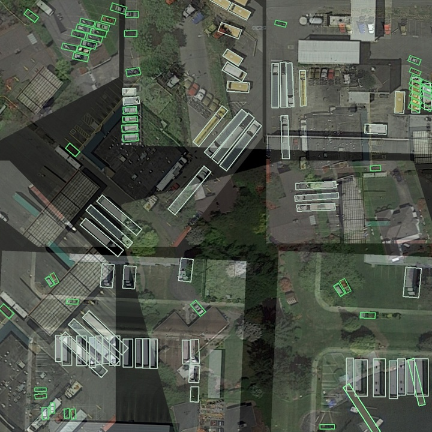

# Oriented RepPoints for Aerial Object Detection


The code for the implementation of “[Oriented RepPoints](https://arxiv.org/abs/2105.11111) + [Swin Transformer](https://arxiv.org/pdf/2103.14030.pdf)/[ReResNet](https://arxiv.org/pdf/2103.07733.pdf)”. 

# Introduction  
Based on the _Oriented Reppoints_ detector with [Swin Transformer](https://github.com/SwinTransformer/Swin-Transformer-Object-Detection) backbone, the **_3rd Place_** is achieved on the **Task 1** and the **_2nd Place_** is achieved on the **Task 2** of _2021 challenge of Learning to Understand Aerial Images ([LUAI](https://captain-whu.github.io/LUAI2021/index.html))_ held on ICCV’2021. The detailed information is introduced in this paper of "_[LUAI Challenge 2021 on Learning to Understand Aerial Images](https://arxiv.org/abs/2108.13246v1), ICCVW2021_".


# New Feature
- **BackBone**: add **Swin-Transformer**, **ReResNet**
- **DataAug**: add **Mosaic4or9**, Mixup, HSV, **RandomPerspective**, **RandomScaleCrop**



# Installation
Please refer to  for installation and dataset preparation.


# Getting Started 
This repo is based on . Please see  for the basic usage.


# Results and Models
The results on DOTA test-dev set are shown in the table below(password:aabb/swin/ABCD). More detailed results please see the paper.

  Model| Backbone  | MS Train/Test | DataAug | DOTAv1 mAP | DOTAv2 mAP| Download
 ----  | ----- | ------  | ------| ------ | ------ | ------ |
 OrientedReppoints| R-50| - | -| 75.68 | - |[baidu(aabb)](https://pan.baidu.com/s/1fCgmpd3MWoCbI80wYwtV2w)
 OrientedReppoints| R-101| - | √| 76.21 | - |[baidu(aabb)](https://pan.baidu.com/s/1WN2QKMR6vrTzrJGCcukt8A)
 OrientedReppoints| R-101| √ | √ | 78.12| - |[baidu(aabb)](https://pan.baidu.com/s/1Rv2ujQEt56R9nw-QjJlMIg)
 OrientedReppoints| SwinT-tiny| - | √ | - | 59.93 | [baidu(aabb)](https://pan.baidu.com/s/10Q9XHs9wPk0W6NbTAiO8UA)

**ImageNet-1K and ImageNet-22K Pretrained Models**

| name | pretrain | resolution |acc@1 | acc@5 | #params | FLOPs | FPS| 22K model | 1K model | Need to turn read version
| :---: | :---: | :---: | :---: | :---: | :---: | :---: | :---: |:---: |:---: |:---: |
| Swin-T | ImageNet-1K | 224x224 | 81.2 | 95.5 | 28M | 4.5G | 755 | - | [github](https://github.com/SwinTransformer/storage/releases/download/v1.0.0/swin_tiny_patch4_window7_224.pth)/[baidu(swin)](https://pan.baidu.com/s/156nWJy4Q28rDlrX-rRbI3w)/[config](https://github.com/microsoft/Swin-Transformer/blob/main/configs/swin_tiny_patch4_window7_224.yaml) | [✔](tools/TorchModel_Save3toSave2.py) |
| Swin-S | ImageNet-1K | 224x224 | 83.2 | 96.2 | 50M | 8.7G | 437 | - | [github](https://github.com/SwinTransformer/storage/releases/download/v1.0.0/swin_small_patch4_window7_224.pth)/[baidu(swin)](https://pan.baidu.com/s/1KFjpj3Efey3LmtE1QqPeQg)/[config](https://github.com/microsoft/Swin-Transformer/blob/main/configs/swin_small_patch4_window7_224.yaml) | [✔](tools/TorchModel_Save3toSave2.py) |
| Swin-B | ImageNet-1K | 224x224 | 83.5 | 96.5 | 88M | 15.4G | 278  | - | [github](https://github.com/SwinTransformer/storage/releases/download/v1.0.0/swin_base_patch4_window7_224.pth)/[baidu(swin)](https://pan.baidu.com/s/16bqCTEc70nC_isSsgBSaqQ)/[config](https://github.com/microsoft/Swin-Transformer/blob/main/configs/swin_base_patch4_window7_224.yaml) | [✔](tools/TorchModel_Save3toSave2.py) |
| Swin-B | ImageNet-1K | 384x384 | 84.5 | 97.0 | 88M | 47.1G | 85 | - | [github](https://github.com/SwinTransformer/storage/releases/download/v1.0.0/swin_base_patch4_window12_384.pth)/[baidu(swin)](https://pan.baidu.com/s/1xT1cu740-ejW7htUdVLnmw)/[test-config](https://github.com/microsoft/Swin-Transformer/blob/main/configs/swin_base_patch4_window12_384.yaml) | [✔](tools/TorchModel_Save3toSave2.py) |
| Swin-B | ImageNet-22K | 224x224 | 85.2 | 97.5 | 88M | 15.4G | 278 | [github](https://github.com/SwinTransformer/storage/releases/download/v1.0.0/swin_base_patch4_window7_224_22k.pth)/[baidu(swin)](https://pan.baidu.com/s/1y1Ec3UlrKSI8IMtEs-oBXA) | [github](https://github.com/SwinTransformer/storage/releases/download/v1.0.0/swin_base_patch4_window7_224_22kto1k.pth)/[baidu(swin)](https://pan.baidu.com/s/1n_wNkcbRxVXit8r_KrfAVg)/[test-config](https://github.com/microsoft/Swin-Transformer/blob/main/configs/swin_base_patch4_window7_224.yaml) | [✔](tools/TorchModel_Save3toSave2.py) |
| Swin-B | ImageNet-22K | 384x384 | 86.4 | 98.0 | 88M | 47.1G | 85 | [github](https://github.com/SwinTransformer/storage/releases/download/v1.0.0/swin_base_patch4_window12_384_22k.pth)/[baidu(swin)](https://pan.baidu.com/s/1vwJxnJcVqcLZAw9HaqiR6g) | [github](https://github.com/SwinTransformer/storage/releases/download/v1.0.0/swin_base_patch4_window12_384_22kto1k.pth)/[baidu(swin)](https://pan.baidu.com/s/1caKTSdoLJYoi4WBcnmWuWg)/[test-config](https://github.com/microsoft/Swin-Transformer/blob/main/configs/swin_base_patch4_window12_384.yaml) | [✔](tools/TorchModel_Save3toSave2.py) |
| Swin-L | ImageNet-22K | 224x224 | 86.3 | 97.9 | 197M | 34.5G | 141 | [github](https://github.com/SwinTransformer/storage/releases/download/v1.0.0/swin_large_patch4_window7_224_22k.pth)/[baidu(swin)](https://pan.baidu.com/s/1pws3rOTFuOebBYP3h6Kx8w) | [github](https://github.com/SwinTransformer/storage/releases/download/v1.0.0/swin_large_patch4_window7_224_22kto1k.pth)/[baidu(swin)](https://pan.baidu.com/s/1NkQApMWUhxBGjk1ne6VqBQ)/[test-config](https://github.com/microsoft/Swin-Transformer/blob/main/configs/swin_large_patch4_window7_224.yaml) | [✔](tools/TorchModel_Save3toSave2.py) |
| Swin-L | ImageNet-22K | 384x384 | 87.3 | 98.2 | 197M | 103.9G | 42 | [github](https://github.com/SwinTransformer/storage/releases/download/v1.0.0/swin_large_patch4_window12_384_22k.pth)/[baidu(swin)](https://pan.baidu.com/s/1sl7o_bJA143OD7UqSLAMoA) | [github](https://github.com/SwinTransformer/storage/releases/download/v1.0.0/swin_large_patch4_window12_384_22kto1k.pth)/[baidu(swin)](https://pan.baidu.com/s/1X0FLHQyPOC6Kmv2CmgxJvA)/[test-config](https://github.com/microsoft/Swin-Transformer/blob/main/configs/swin_large_patch4_window12_384.yaml) | [✔](tools/TorchModel_Save3toSave2.py) |
| ReResNet50 | ImageNet-1K | 224x224| 71.20 | 90.28 | - | - | - | - | [google](https://drive.google.com/file/d/1FshfREfLZaNl5FcaKrH0lxFyZt50Uyu2/view?usp=sharing)/[baidu(ABCD)](https://pan.baidu.com/s/1ENIkUVB_5-QRQhr0Vl-FMw)/[log](https://drive.google.com/file/d/1VLW8YbU1kGpqd4hfvI9UItbCOprzo-v4/view?usp=sharing)| - |

The mAOE results on DOTAv1 val set are shown in the table below(password:aabb).

  Model| Backbone | mAOE | Download
 ----  | ----- | ------  | ------
 OrientedReppoints| R-50| 5.93° |[baidu(aabb)](https://pan.baidu.com/s/1TeHDeuVTKpXd5KdYY51TUA)


 Note：
 * Wtihout the ground-truth of test subset, the mAOE of orientation evaluation is calculated on the val subset(original train subset for training).
 * The orientation (angle) of an aerial object is define as below, the detail of mAOE, please see the paper. The code of mAOE is [mAOE_evaluation.py](DOTA_devkit/mAOE_evaluation.py).
 

 
# Visual results
The visual results of learning points and the oriented bounding boxes. The visualization code is .

* Learning points


* Oriented bounding box


# More details
[DOTAv2遥感图像旋转目标检测竞赛经验分享（Swin Transformer + Anchor free/based方案）](https://zhuanlan.zhihu.com/p/422764914)

# Citation
```shell
@article{li2021oriented,
	title="Oriented RepPoints for Aerial Object Detection.",
	author="Wentong {Li}, Yijie {Chen}, Kaixuan {Hu}, Jianke {Zhu}.",
	journal="arXiv preprint arXiv:2105.11111",
	year="2021"
}
```


#  Acknowledgements
I have used utility functions from other wonderful open-source projects. Espeicially thank the authors of:

[OrientedRepPoints](https://github.com/LiWentomng/OrientedRepPoints)

[Swin-Transformer-Object-Detection](https://github.com/SwinTransformer/Swin-Transformer-Object-Detection)

[ReDet](https://github.com/csuhan/ReDet)

